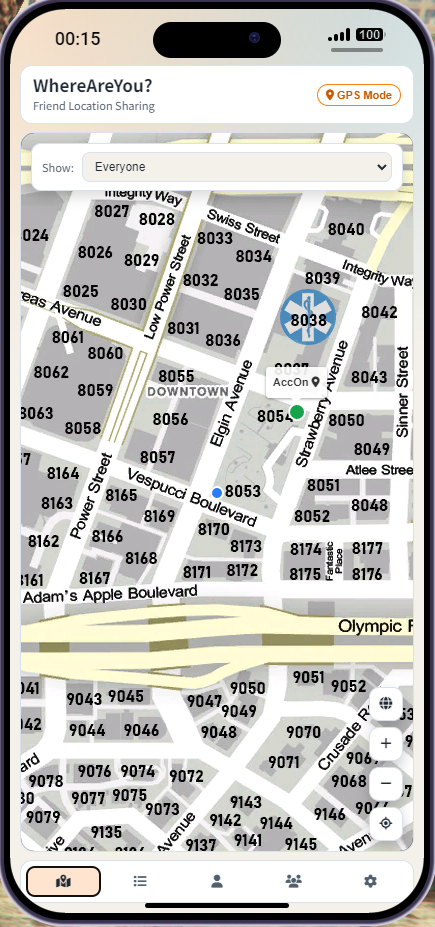
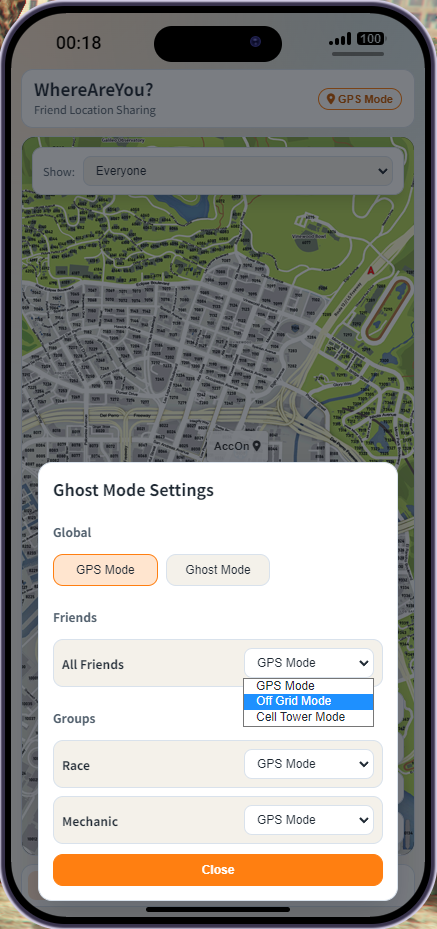
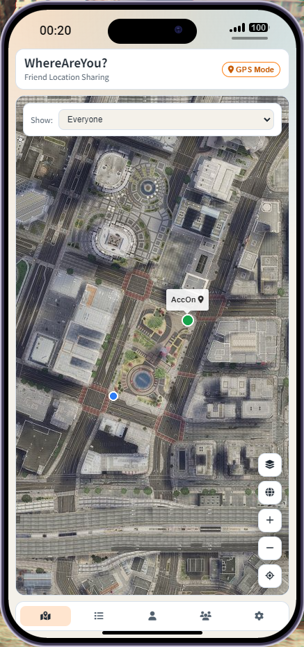
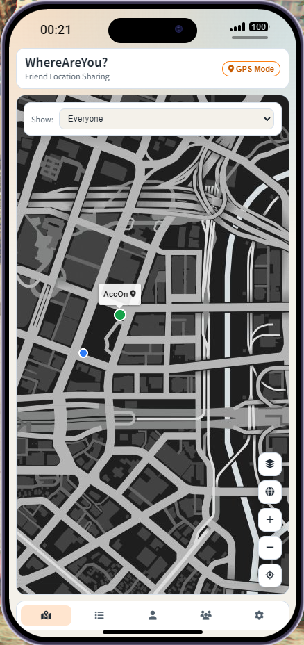
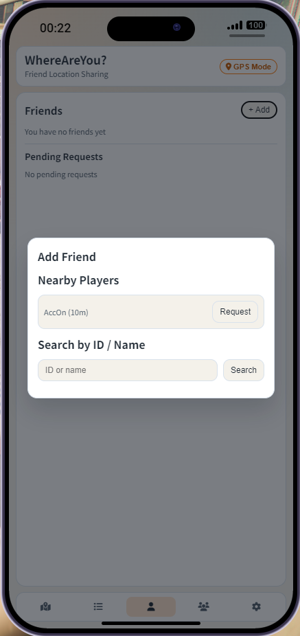
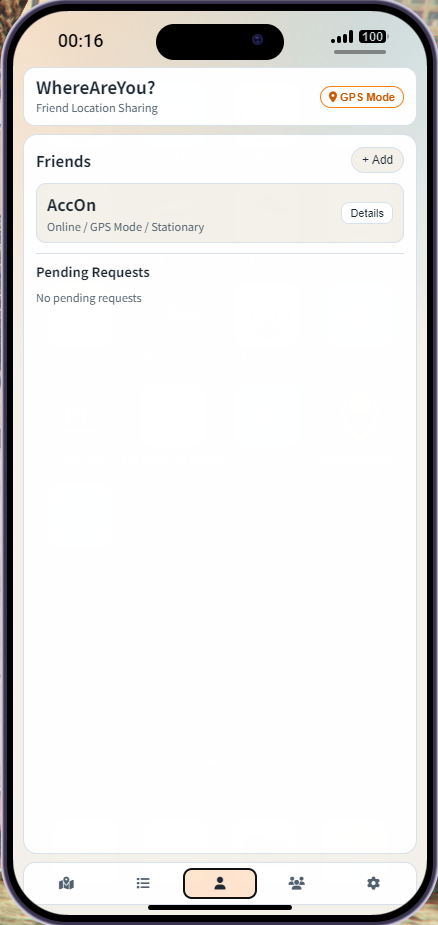
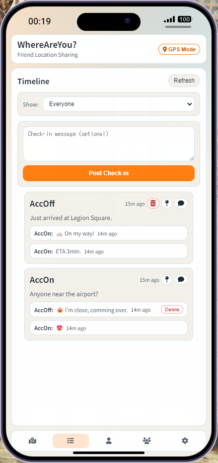
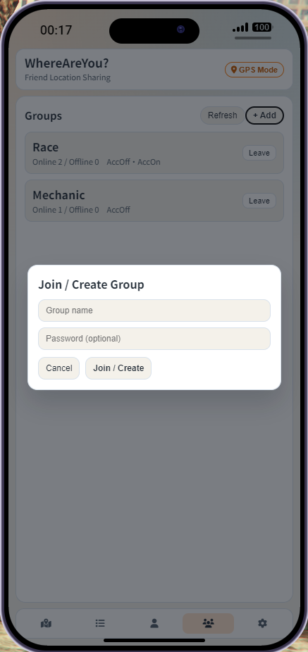
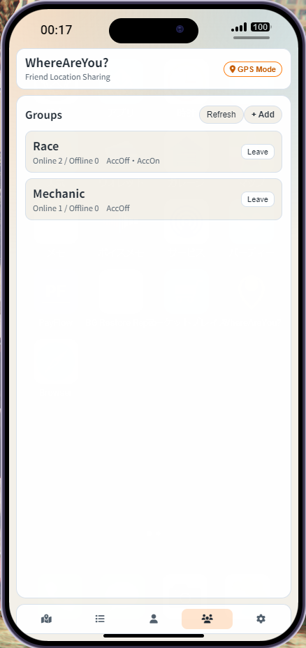

# WhereAreYou? for LB-Phone

Japanese README: [README_ja.md](README_ja.md)

Find out where your friends are right away.
Meet up faster, chat more, and keep the game session connected.

WhereAreYou? is a location-sharing app for FiveM + LB-Phone.
It combines map visibility, ghost mode controls, friend management, timeline posts, and reactions in one app.

This project was built mainly with **GitHub Copilot** and reached a working state in about **15 hours**.

## Installation

### 1. Place the release ZIP

1. Download the latest ZIP from GitHub Releases.
2. Extract the ZIP file.
3. The ZIP filename includes the version tag, but the extracted folder name is always `lb-app-where-are-you`.
4. Put the extracted resource folder under your FiveM server's `resources` directory.
5. Add `ensure lb-app-where-are-you` to `server.cfg`.

### 2. Run SQL

Execute `sql.sql` against your current database (typically the one connected via oxmysql).

This SQL creates tables for player profiles, friend relationships, groups, posts, and reactions.

### 3. Minimum folder check

After placement, confirm that the resource root includes at least the following:

```text
lb-app-where-are-you/
	fxmanifest.lua
	config.lua
	client/
	server/
	ui/dist/
	sql.sql
```

### 4. Install a Custom Map (optional but recommended)

This app uses lb-phone's built-in `GameMap` component and does not bundle any map tile images.
By default the map uses whatever tile set lb-phone provides out of the box.

To use the **PostalCodeMap** shown in the README screenshots, add an entry to `Config.CustomMaps` in `lb-phone/config/config.lua`.

> **Note:** `Config.CustomMaps` defaults to `{}`, in which case lb-phone uses its built-in maps automatically.
> Once you define any entry in `Config.CustomMaps`, the built-in maps are no longer added automatically —
> so if you want to keep the default maps (Los Santos, Cayo Perico, etc.) alongside PostalCodeMap,
> you must include them explicitly in the list.

```lua
Config.CustomMaps = {
    {
        label       = "Postal Code Map",
        url         = "https://postal-code-map-tile.pages.dev/tiles/{z}/{x}/{y}.png",
        center      = { 1650, 450 },
        topLeft     = { -4140, 8400 },
        bottomRight = { 4860, -5100 },
        resolution  = { 6144, 9216 },
        zoom = { default = 3, max = 6, min = 0 },
        styles = {
            { name = "render", background = "#000000" },
        },
    },
    -- To keep the default maps, copy their entries here from lb-phone/config/config.lua
}
```

For the full tile configuration details and default map entries, see: <https://github.com/Acc-Off/postal-code-map-tile#using-with-lb-phone>

Once added, players can select **Postal Code Map** from the map style picker inside lb-phone (and inside this app).

## Configuration (`config.lua`)

Main configuration entries:

| Item                            |                 Default value | Description                                           |
| ------------------------------- | ----------------------------: | ----------------------------------------------------- |
| `Config.Identifier`             |                 `whereareyou` | App identifier in LB-Phone (unique value recommended) |
| `Config.Name`                   |                `WhereAreYou?` | App display name                                      |
| `Config.Description`            | `Friend location sharing app` | App description                                       |
| `Config.Developer`              |        `lb-app-where-are-you` | Developer/resource name label                         |
| `Config.DefaultApp`             |                       `false` | Auto-install for all players                          |
| `Config.PositionPushIntervalMs` |                        `2000` | Position push interval (ms)                           |
| `Config.BlurGridSize`           |                       `200.0` | Coordinate rounding size for blurred display          |
| `Config.WalkSpeedThreshold`     |                         `1.2` | Minimum speed threshold for walking state             |
| `Config.VehicleSpeedThreshold`  |                         `8.0` | Minimum speed threshold for vehicle movement          |
| `Config.NearbyRadiusDefault`    |                        `30.0` | Default nearby notification radius                    |
| `Config.NearbyNotifyEnabled`    |                       `false` | Initial nearby notification ON/OFF                    |
| `Config.NearbyNotifyIntervalMs` |                       `10000` | Nearby check interval (ms)                            |
| `Config.NearbyNotifyCooldownMs` |                       `60000` | Cooldown before notifying about the same player again |
| `Config.PostCooldownMs`         |                       `30000` | Check-in post cooldown (ms)                           |

## Features

### Core features

| Map screen                                                     | Ghost mode settings                                                     |
| -------------------------------------------------------------- | ----------------------------------------------------------------------- |
|  |  |
|  |           |

- First-run consent flow (only on first launch)
- Friend location rendering on map (powered by lb-phone's built-in GameMap component)
- One-tap return to your own location (GPS button)
- View filters (All / Friends / Groups)

### Ghost mode and visibility control

- Global status switch (Normal / Hidden)
- Friend visibility mode switch (GPS / Offline / Cell Tower)
- Per-group visibility mode switch
- Stop location sharing on emergency off

### Friends

| Add friend                                                     | Friends list                                                     |
| -------------------------------------------------------------- | ---------------------------------------------------------------- |
|  |  |

- Send requests from nearby player candidates
- Send requests by ID/name search
- Accept / Decline / Block / Unblock
- Friend detail dialog
- Friend removal confirmation dialog

### Timeline

| Timeline                                                     |
| ------------------------------------------------------------ |
|  |

- Current location check-in posts
- Post list (relative timestamps)
- Jump map view to post location
- Delete posts
- Send reactions (stamp + short message)
- Delete reactions

### Groups

| Join or create group                                                     | Groups list                                                     |
| ------------------------------------------------------------------------ | --------------------------------------------------------------- |
|  |  |

- Create / join groups (modal input)
- Joined group list
- Member display
- Leave group

### Settings

- Nearby notification ON/OFF
- Nearby notification radius
- Nearby check interval
- Withdraw account (delete related data)

## Operational Notes

- The location tracking implementation is designed to keep game server and database server load as low as possible.
- Large-scale testing with many concurrent players has not been fully completed yet, so please monitor server load after introducing this resource.
- Feedback and pull requests are always welcome.

----

## Development and Build (when editing UI)

The UI (React + Vite) is under `src/ui`.

### 1. Install dependencies

```bash
cd src/ui
npm install
```

### 2. Start development server

```bash
npm run dev
```

### 3. Production build

```bash
npm run build
```

Build output is generated in `src/ui/dist`.

### 4. Required directories for deployment

If you update UI and deploy to server, ensure the final resource structure is:

```text
lb-app-where-are-you/
	fxmanifest.lua
	config.lua
	client/
	server/
	ui/
		dist/
			index.html
			assets/
```

`fxmanifest.lua` references `ui/dist/index.html`, so do not remove `ui/dist`.