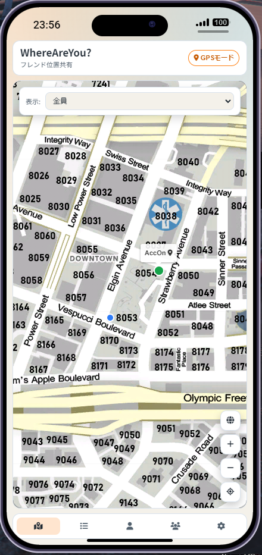
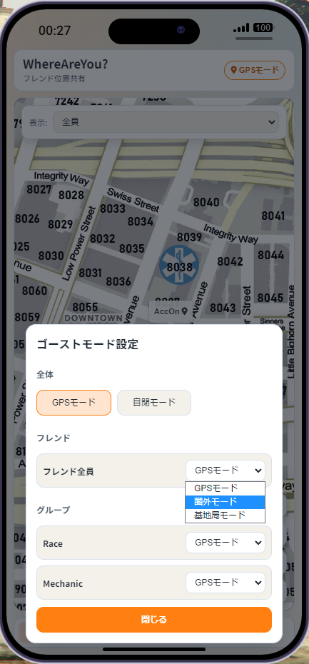
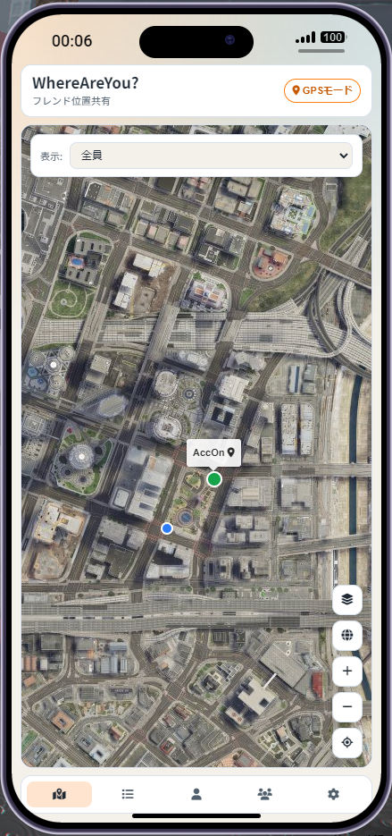
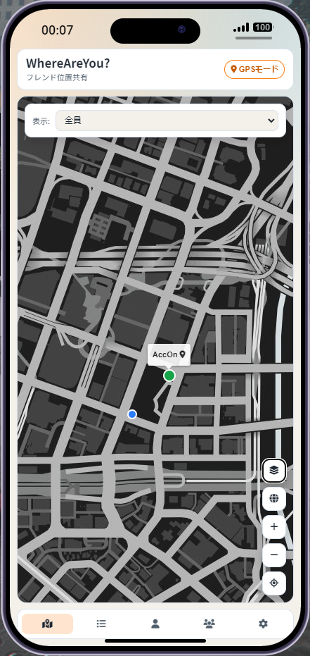
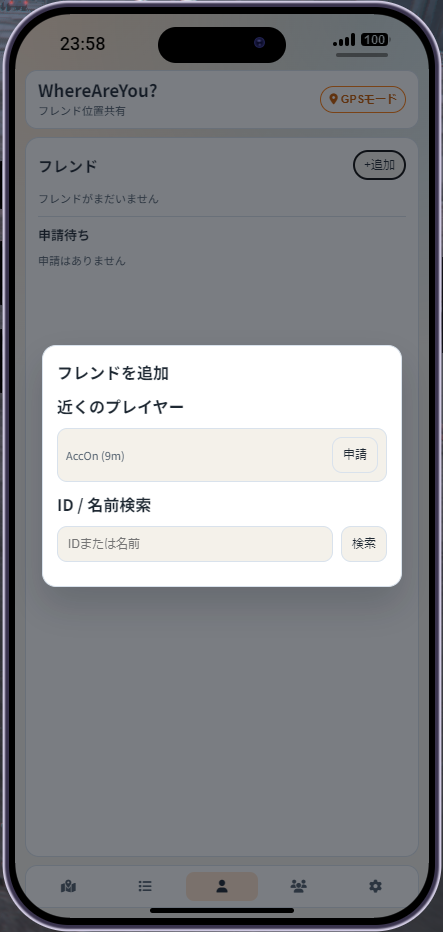
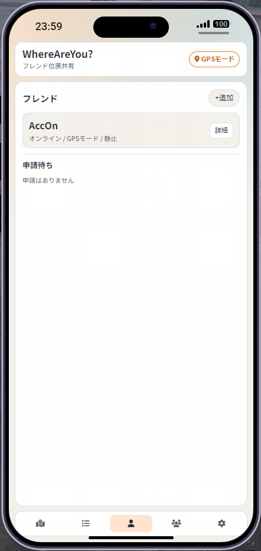
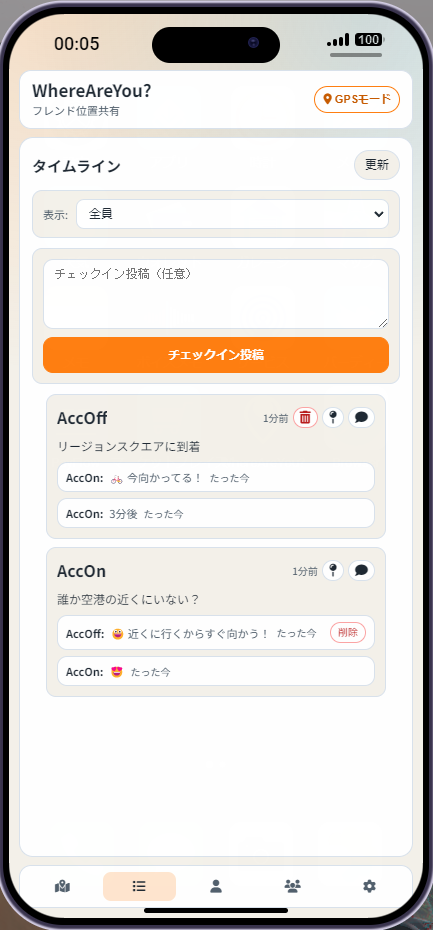
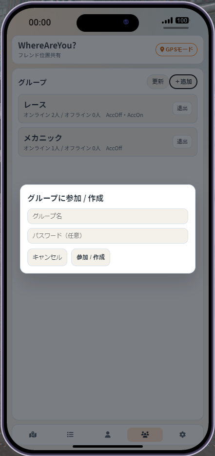
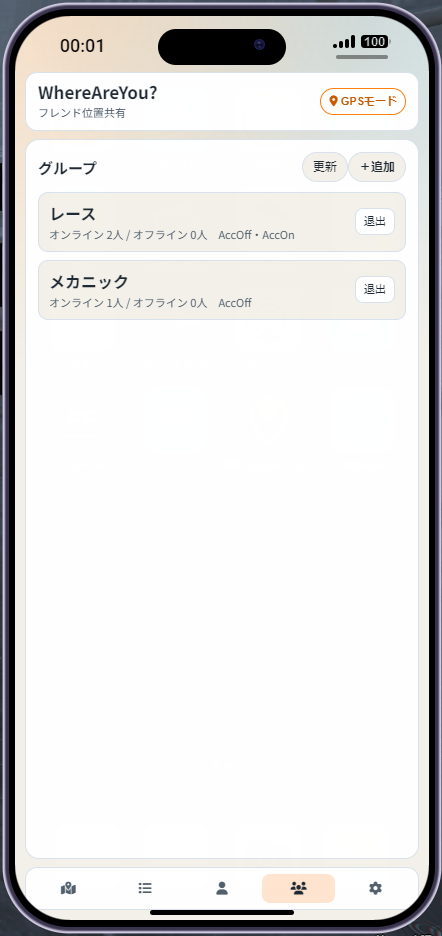

# WhereAreYou? for LB-Phone

フレンドの「今どこ？」が、すぐ分かる。
合流が速くなる、会話が増える、遊びがつながる。

WhereAreYou? は FiveM + LB-Phone 向けの位置共有アプリです。
地図表示だけでなく、ゴーストモード、フレンド管理、タイムライン投稿、リアクションまでを1つにまとめています。

このプロジェクトの実装は **GitHub Copilot** 主導で進め、**おおよそ15時間**で形にしました。

## インストール方法

### 1. リリース ZIP を配置

1. GitHub の Releases から最新 ZIP をダウンロードします。
2. ZIP を解凍します。
3. ZIP ファイル名にはバージョンが含まれますが、解凍後のフォルダ名は常に `lb-app-where-are-you` です。
4. 解凍して出てきたリソースフォルダを、FiveM サーバーの `resources` 配下へ配置します。
5. `server.cfg` に `ensure lb-app-where-are-you` を追加します。

### 2. SQL を実行

`sql.sql` の内容を、使用中の DB（通常は oxmysql 接続先）へ実行してください。

この SQL で、プレイヤー情報・フレンド関係・グループ・投稿・リアクション用のテーブルが作成されます。

### 3. 最低限の配置確認

配置後、リソース直下に少なくとも以下があることを確認してください。

```text
lb-app-where-are-you/
	fxmanifest.lua
	config.lua
	client/
	server/
	ui/dist/
	sql.sql
```

### 4. カスタムマップの導入（任意・推奨）

このアプリは lb-phone 内蔵の `GameMap` コンポーネントを使用しており、タイル画像はバンドルしていません。
既定では lb-phone が標準で提供する地図がそのまま使用されます。

README のスクリーンショットと同じ **PostalCodeMap** を使用するには、`lb-phone/config/config.lua` の `Config.CustomMaps` にエントリを追加してください。

> **注意:** `Config.CustomMaps` の既定値は `{}` で、その場合は lb-phone が標準の組み込みマップを自動的に使用します。
> `Config.CustomMaps` に1つでもエントリを定義すると、標準マップは自動追加されなくなります。
> デフォルトマップ（Los Santos・Cayo Perico 等）も引き続き使いたい場合は、それらのエントリも明示的にリストへ含める必要があります。

```lua
Config.CustomMaps = {
    {
        label       = "Postal Code Map",
        url         = "https://postal-code-map-tile.pages.dev/tiles/{z}/{x}/{y}.png",
        center      = { 1650, 450 },
        topLeft     = { -4140, 8400 },
        bottomRight = { 4860, -5100 },
        resolution  = { 6144, 9216 },
        zoom = { default = 3, max = 6, min = 0 },
        styles = {
            { name = "render", background = "#000000" },
        },
    },
    -- デフォルトマップも使い続ける場合は、lb-phone/config/config.lua からそのエントリをここへコピーしてください
}
```

タイル設定の詳細やデフォルトマップのエントリは下記を参照してください: <https://github.com/Acc-Off/postal-code-map-tile#using-with-lb-phone>

追加後、lb-phone（およびこのアプリ）の地図スタイル選択から **Postal Code Map** を選択できます。

## 設定（config.lua）

主な設定項目は以下です。

| 項目                            |                        既定値 | 説明                                      |
| ------------------------------- | ----------------------------: | ----------------------------------------- |
| `Config.Identifier`             |                 `whereareyou` | LB-Phone 内のアプリ識別子（ユニーク推奨） |
| `Config.Name`                   |                `WhereAreYou?` | アプリ表示名                              |
| `Config.Description`            | `Friend location sharing app` | アプリ説明                                |
| `Config.Developer`              |        `lb-app-where-are-you` | 開発者/リソース名表示                     |
| `Config.DefaultApp`             |                       `false` | 全プレイヤーへ自動インストールするか      |
| `Config.PositionPushIntervalMs` |                        `2000` | 位置送信間隔（ms）                        |
| `Config.BlurGridSize`           |                       `200.0` | あいまい表示時の座標丸めサイズ            |
| `Config.WalkSpeedThreshold`     |                         `1.2` | 徒歩判定の下限速度                        |
| `Config.VehicleSpeedThreshold`  |                         `8.0` | 車両移動判定の下限速度                    |
| `Config.NearbyRadiusDefault`    |                        `30.0` | 近距離通知の初期半径                      |
| `Config.NearbyNotifyEnabled`    |                       `false` | 近距離通知の初期ON/OFF                    |
| `Config.NearbyNotifyIntervalMs` |                       `10000` | 近距離判定の実行間隔（ms）                |
| `Config.NearbyNotifyCooldownMs` |                       `60000` | 同一相手への再通知クールダウン（ms）      |
| `Config.PostCooldownMs`         |                       `30000` | チェックイン投稿クールダウン（ms）        |

## 機能詳細

### コア機能

| 地図画面                                                     | ゴーストモード設定                                                     |
| ------------------------------------------------------------ | ---------------------------------------------------------------------- |
|  |  |
|  |            |

- 初回同意フロー（初回起動時のみ）
- 地図でのフレンド位置表示（lb-phone 内蔵の GameMap コンポーネントを使用）
- 自分位置へのワンタップ復帰（GPSボタン）
- 表示フィルタ（全員 / フレンド / グループ）

### ゴーストモードと可視性制御

- 全体切替（通常 / 自閉）
- フレンド向け公開モード切替（GPS / 圏外 / 基地局）
- グループごとの公開モード切替
- 緊急オフ時の位置共有停止

### フレンド機能

| フレンド追加                                                     | フレンド一覧                                                     |
| ---------------------------------------------------------------- | ---------------------------------------------------------------- |
|  |  |

- 近くのプレイヤー候補から申請
- ID / 名前検索から申請
- 承認 / 辞退 / ブロック / 解除
- フレンド詳細ダイアログ
- フレンド削除確認ダイアログ

### タイムライン機能

| タイムライン                                                     |
| ---------------------------------------------------------------- |
|  |

- 現在地チェックイン投稿
- 投稿一覧表示（相対時刻）
- 投稿位置への地図ジャンプ
- 投稿削除
- リアクション送信（スタンプ + 短文）
- リアクション削除

### グループ機能

| グループ一覧追加                                                 | グループ一覧                                                         |
| ---------------------------------------------------------------- | -------------------------------------------------------------------- |
|  |  |

- グループ作成 / 参加（モーダル入力）
- 参加中グループ一覧表示
- メンバー表示
- グループ退出

### 設定機能

- 近距離通知 ON/OFF
- 近距離通知半径の設定
- 近距離チェック間隔の設定
- 退会（関連データ削除）

## 運用上の注意

- 位置追跡の実装は、ゲームサーバーおよびデータベースサーバーの負荷をできるだけ抑える方針で設計しています。
- ただし、大人数同時接続での十分な検証はまだ実施できていないため、導入時はサーバー負荷の監視をお願いします。
- フィードバックやプルリクエストも歓迎しています。

----

## 開発・ビルド手順（UI を編集する場合）

UI（React + Vite）は `src/ui` 配下です。

### 1. 依存関係インストール

```bash
cd src/ui
npm install
```

### 2. 開発サーバー起動

```bash
npm run dev
```

### 3. 本番ビルド

```bash
npm run build
```

ビルド成果物は `src/ui/dist` に出力されます。

### 4. 配置時に必要なディレクトリ

UI を更新してサーバーへ反映する場合、最終的にリソース配下が次の構成になっていれば動作します。

```text
lb-app-where-are-you/
	fxmanifest.lua
	config.lua
	client/
	server/
	ui/
		dist/
			index.html
			assets/
```

`fxmanifest.lua` は `ui/dist/index.html` を参照するため、`ui/dist` を削らないようにしてください。