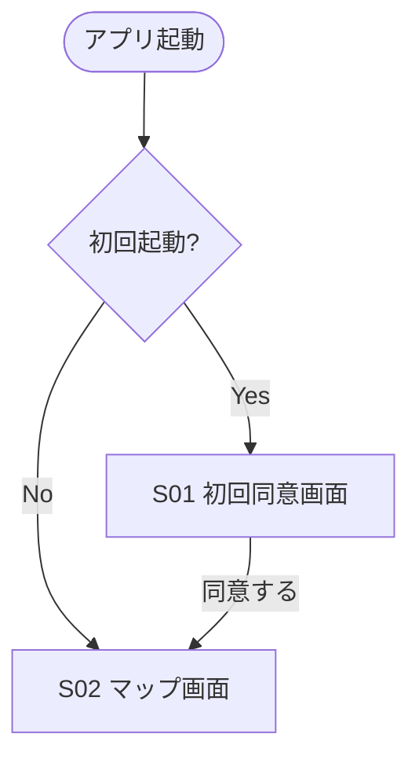
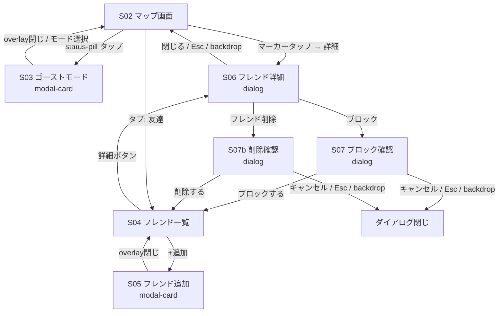
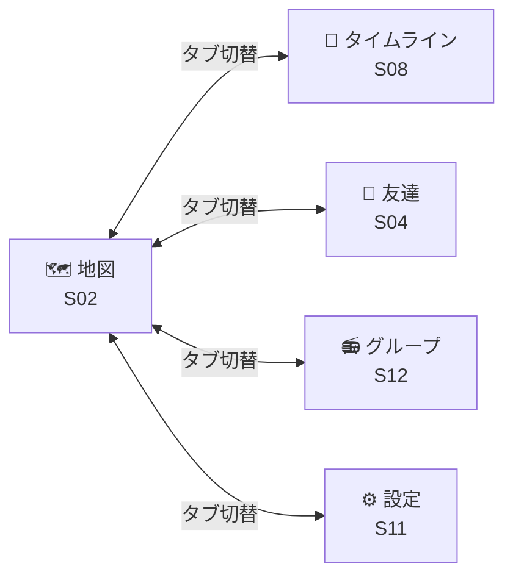
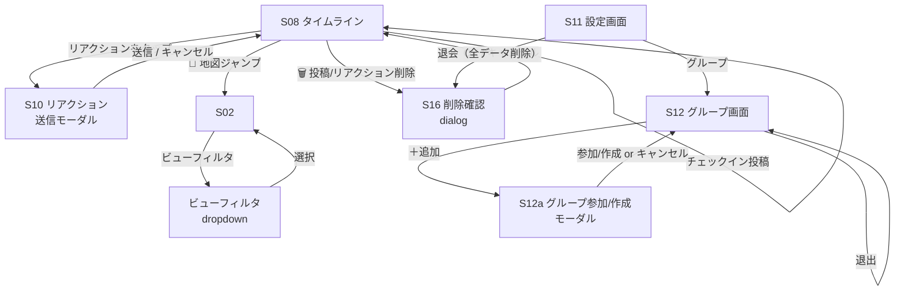
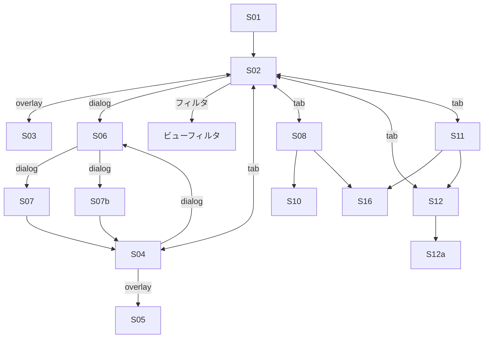

# 画面遷移図

## 画面一覧

| 画面ID | 画面名                     | 種類               | 説明                                               |
| ------ | -------------------------- | ------------------ | -------------------------------------------------- |
| S01    | 初回同意画面               | overlay            | 初回起動時のみ表示。位置共有の説明と同意           |
| S02    | マップ画面（メイン）       | tab                | フレンドの位置をマップ上に CircleMarker で表示     |
| S03    | ゴーストモード設定パネル   | modal-card         | 全体切替 + フレンド/グループ別設定を1シートで操作  |
| S04    | フレンド一覧画面           | tab                | コンパクト1行レイアウトでステータス+アクション     |
| S05    | フレンド追加画面           | modal-card         | 近くのプレーヤー候補またはID/名前検索で申請        |
| S06    | フレンド詳細ダイアログ     | `<dialog>`         | 対象の1行サマリと関係表示（フレンド/同一グループ） |
| S07    | ブロック確認ダイアログ     | `<dialog>`         | ブロック実行前の確認。Esc/backdrop で閉じ可        |
| S07b   | フレンド削除確認ダイアログ | `<dialog>`         | 削除実行前の確認。Esc/backdrop で閉じ可            |
| S08    | タイムライン画面           | tab                | フレンドのチェックイン投稿一覧                     |
| S10    | リアクション送信モーダル   | modal              | スタンプ・短文を送れるモーダル                     |
| S11    | 設定画面                   | tab                | 通知・プライバシー・更新間隔設定                   |
| S12    | グループ画面               | tab内サブ or modal | グループ作成・参加・退出・メンバー一覧             |
| S16    | 汎用削除確認ダイアログ     | `<dialog>`         | 投稿削除/リアクション削除/退会を確認               |

---

## アプリ起動フロー

---

## メイン遷移

注: S06 → S07/S07b は S06 を close してから S07/S07b を showModal する流れ。
ブロック/削除実行後は友達一覧（S04）に遷移してリフレッシュ。

---

## タブナビゲーション

---

## タイムライン・グループ・フィルタ 遷移

---

## 遷移サマリー（全体）

