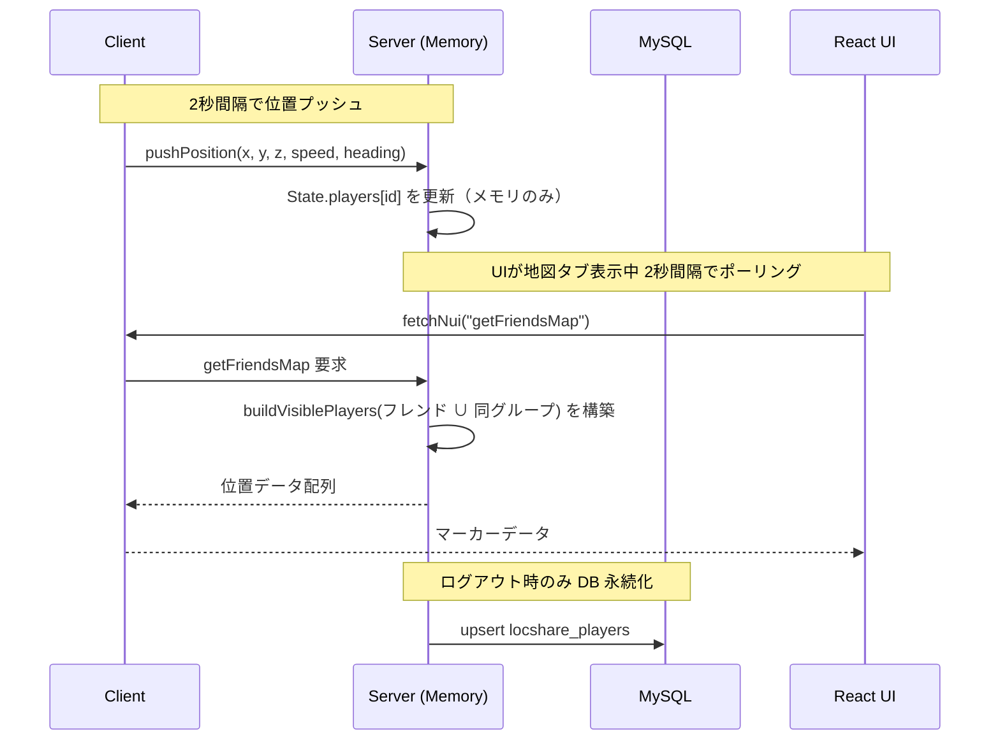
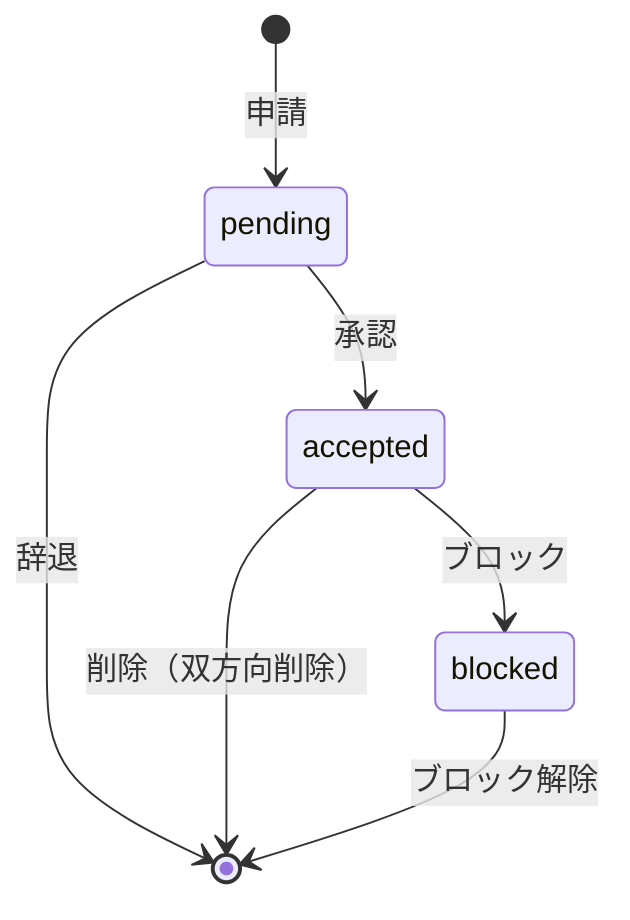
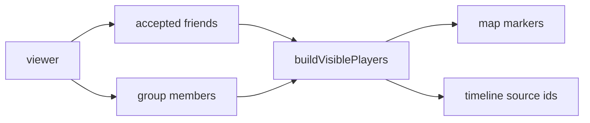

# アーキテクチャ設計書

## 概要

WhereAreYou? は FiveM 向け lb-phone カスタムアプリとして構築された位置共有アプリ。
React + TypeScript（UI）、Lua（client/server）、MySQL（oxmysql）で構成される。

現行実装はグループ・ビューフィルタ・タイムライン・リアクション・近距離通知・設定画面まで反映済み。

---

## ファイル構成

### Client（Lua）

| ファイル                            | 役割                                                           |
| ----------------------------------- | -------------------------------------------------------------- |
| `bootstrap.lua`                     | `WAY.Client` と `Client.State` 初期化                          |
| `bridge.lua`                        | 座標取得、Server RPC 呼び出し、lb-phone 通知・UIメッセージ送信 |
| `app.lua`                           | `AddCustomApp` 登録、開閉時 bootstrap 同期                     |
| `sync.lua`                          | 位置送信ループ、近距離可視プレイヤー通知ループ                 |
| `callbacks/bootstrap_callbacks.lua` | 起動処理、通知イベント、bootstrap系NUIコールバック             |
| `callbacks/friends_callbacks.lua`   | フレンド/検索/申請/詳細/ブロック系 NUIコールバック             |
| `callbacks/groups_callbacks.lua`    | グループ参加/退出/一覧/モード系 NUIコールバック                |
| `callbacks/map_callbacks.lua`       | 地図関連 NUIコールバック                                       |
| `callbacks/timeline_callbacks.lua`  | タイムライン/リアクション/削除系 NUIコールバック               |
| `callbacks/account_callbacks.lua`   | 退会 NUIコールバック                                           |

### Server（Lua）

| ファイル                           | 役割                                                                                                 |
| ---------------------------------- | ---------------------------------------------------------------------------------------------------- |
| `bootstrap.lua`                    | `Server` テーブル定義、`Server.State` 初期化                                                         |
| `utils.lua`                        | ユーティリティ関数                                                                                   |
| `repository/base.lua`              | DB共通処理（fetchAll/fetchOne/execute）。`Server.Repository.*` として全 V2 Repo から内部利用される。 |
| `domain/service_core.lua`          | ライフサイクル専用（位置更新受信/ログアウト保存/起動時初期化/近距離ループ/フラッシュ）               |
| `domain/request_helpers.lua`       | リクエスト共通ヘルパ                                                                                 |
| `domain/friends_service.lua`       | フレンドドメイン本体（申請/承認/ブロック/一覧/詳細）                                                 |
| `domain/groups_service.lua`        | グループドメイン本体（参加/退出/一覧/モード）                                                        |
| `domain/visibility_service.lua`    | 可視性ドメイン本体（可視プレイヤー解決/最緩和モード）                                                |
| `domain/timeline_service.lua`      | タイムラインドメイン本体（取得/投稿/削除）                                                           |
| `domain/reactions_service.lua`     | リアクションドメイン本体（作成/削除/可視性検証）                                                     |
| `domain/settings_service.lua`      | 設定ドメイン本体（取得/保存）                                                                        |
| `domain/account_service.lua`       | 退会ドメイン本体（関連データ削除）                                                                   |
| `domain/nearby_service.lua`        | 近距離ドメイン本体（候補/可視プレイヤー/通知ループ）                                                 |
| `domain/notifications_service.lua` | 通知ドメイン本体（申請/承認/状態変化/リアクション通知）                                              |
| `domain/actions_core.lua`          | bootstrap/設定/基本アクション                                                                        |
| `domain/actions_friends.lua`       | フレンド関連アクション                                                                               |
| `domain/actions_groups.lua`        | グループ関連アクション                                                                               |
| `domain/actions_timeline.lua`      | タイムライン関連アクション                                                                           |
| `domain/actions_account.lua`       | 退会アクション                                                                                       |
| `domain/request_dispatcher.lua`    | actionディスパッチ（`Service.handleRequest` 入口）                                                   |
| `repository/players_repo.lua`      | Players RepositoryV2（同意/表示名保存/座標UPSERT/ゴーストモード全穎）                                |
| `repository/friends_repo.lua`      | Friends RepositoryV2（方向関係CRUD/pending取得山値・削除/ブロック山値たもの削除）                    |
| `repository/groups_repo.lua`       | Groups RepositoryV2（グループ/参加/モード管理/起動時一括取得）                                       |
| `repository/posts_repo.lua`        | Posts RepositoryV2（投稿CRUD/可視投稿補助）                                                          |
| `repository/reactions_repo.lua`    | Reactions RepositoryV2（リアクションCRUD）                                                           |
| `repository/settings_repo.lua`     | Settings RepositoryV2（アプリ設定）                                                                  |
| `repository/account_repo.lua`      | Account RepositoryV2（退会削除）                                                                     |
| `events.lua`                       | ネットワークイベントハンドラ（request/response, updatePosition）                                     |

### UI（React + TypeScript）

| ファイル                                       | 役割                                                     |
| ---------------------------------------------- | -------------------------------------------------------- |
| `src/App.tsx`                                  | 薄いエントリ（`AppShell` 呼び出しのみ）                  |
| `src/app/AppShell.tsx`                         | 画面状態とドメイン操作を統合するメインシェル             |
| `src/app/tabs.ts`                              | タブ定義                                                 |
| `src/features/map/MapTab.tsx`                  | 地図タブ本体                                             |
| `src/features/map/MapMarkerLayer.tsx`          | 地図マーカーレイヤ                                       |
| `src/features/friends/FriendsTab.tsx`          | フレンドタブ本体                                         |
| `src/features/friends/FriendAddModal.tsx`      | フレンド追加モーダル                                     |
| `src/features/friends/FriendDetailDialog.tsx`  | フレンド詳細/確認ダイアログ                              |
| `src/features/groups/GroupsTab.tsx`            | グループタブ本体                                         |
| `src/features/groups/GroupJoinModal.tsx`       | グループ参加/作成モーダル                                |
| `src/features/timeline/TimelineTab.tsx`        | タイムラインタブ本体                                     |
| `src/features/timeline/ReactionModal.tsx`      | リアクションモーダル                                     |
| `src/features/settings/SettingsTab.tsx`        | 設定タブ本体                                             |
| `src/features/account/DeleteConfirmDialog.tsx` | 投稿/リアクション/退会の削除確認ダイアログ               |
| `src/features/shared/types.ts`                 | UI共通型定義                                             |
| `src/features/shared/presentation.ts`          | 表示用ヘルパ（相対時刻/ラベル/表示色）                   |
| `src/features/shared/ui/Header.tsx`            | 共通ヘッダー                                             |
| `src/features/shared/ui/TabBar.tsx`            | 共通タブバー                                             |
| `src/features/shared/api/callApi.ts`           | NUI API呼び出し共通ラッパ                                |
| `src/features/shared/api/nuiClient.ts`         | NUIクライアントの再エクスポート                          |
| `src/features/shared/api/response.ts`          | APIレスポンス補助                                        |
| `src/features/shared/hooks/useDialog.ts`       | dialog 操作フック                                        |
| `src/features/shared/hooks/useAppBootstrap.ts` | bootstrap 取得フック                                     |
| `src/main.tsx`                                 | エントリーポイント（devMode判定 + componentsLoaded待機） |
| `src/styles.css`                               | 全スタイル定義（モーダル、タイムライン、設定画面含む）   |
| `src/types/lb-phone.d.ts`                      | lb-phone グローバル API の型定義                         |
| `src/utils/nui.ts`                             | NUIイベント購読と fetch ラッパ                           |
| `src/utils/map.ts`                             | マップ座標変換・CRS定義                                  |

---

## ランタイムメモリキャッシュ

### 設計方針

位置情報は **オンライン中はメモリ優先** で管理し、DB I/O を最小化する。

```
Client → (2秒間隔 push) → Server.State.players[playerId] → (UIポーリング) → UI
```

DB 書き込みが発生するタイミング:
- プレイヤーログアウト時（playerDropped）
- リソース停止時（onResourceStop）
- ゴーストモード変更時
- フレンド操作時（追加・削除・ブロック等）
- 投稿作成・リアクション作成時
- アプリ設定保存時

### Server.State 構造

```lua
Server.State = {
    players = {},           -- [playerId] = { x, y, z, speed, heading, ghostMode, ... }
    sourceToPlayerId = {},  -- [source] = playerId（逆引きマップ）
    lastKnownNames = {},    -- [playerId] = displayName（オフライン名キャッシュ）
    nearbyCooldowns = {},   -- [key] = timestamp（近距離通知クールダウン）
    postCooldowns = {},     -- [playerId] = timestamp（投稿クールダウン）
    groups = {},            -- [groupId] = group
    playerGroups = {},      -- [playerId] = groups[]
    friendRelations = {},   -- [playerId] = { outgoing = {}, incoming = {} }
    playerLastKnown = {},   -- [playerId] = { ghostMode, x, y, z }
    nearbyLoopStarted = false,
}
```

### 位置データフロー



---

## フレンドモデル

### 方向性ありモデル（Directional Friend Model）

A が B にフレンド申請 → `locshare_friends` に A→B レコードが作成される。
B が承認 → B→A レコードも作成される（双方向）。

```
A→B: { player_id: A, friend_id: B, status: 'accepted' }
B→A: { player_id: B, friend_id: A, status: 'accepted' }
```

- ブロックは方向付き: A が B をブロック → A→B を `blocked` に更新
- 削除は双方向: A が B を削除 → A→B, B→A の両方を削除

### ステータス遷移



---

## 表示名解決（resolveDisplayName）

フレンド一覧やマップで表示する名前の優先順位:

```
1. Server.State.players[id] のリアルタイム名（オンライン時）
2. Server.State.lastKnownNames[id]（メモリキャッシュ）
3. locshare_players.display_name（DB永続化された名前）
4. playerId フォールバック
```
`display_name` はサーバー接続時・同期待機中に `locshare_players` へ保存される。

---

## ゴーストモード

| モード   | 地図上の表示                                 | 位置精度                |
| -------- | -------------------------------------------- | ----------------------- |
| `normal` | 正確な位置（緑マーカー）                     | そのまま                |
| `freeze` | 切替時の位置で固定（グレーマーカー）         | フリーズ時点の座標      |
| `blur`   | グリッドに丸めた位置（スカイブルーマーカー） | BlurGridSize 単位で丸め |
| `off`    | 地図に非表示                                 | —                       |

グローバル `off` はキルスイッチ、精度制御は `friend_ghost_mode` と `locshare_group_members.ghost_mode` で行う。

最終表示は「最緩和ルール」で決定する（例: フレンド=freeze かつ グループ=normal の場合は normal）。

---

## グループ・可視性モデル

- 可視対象は `フレンド ∪ 同グループ`。
- 地図表示はビューフィルタ `all / friends / group:<id>` を適用。
- タイムライン取得も同一フィルタを適用。
- 地図タブのフィルタUIは地図上部の固定オーバーレイとして表示し、地図操作時にも画面から消えない。
- タイムラインの投稿「地図」操作では、マップ中心を投稿座標へ移動し、投稿位置ピンを描画する。



---

## SNS機能（タイムライン/リアクション）

- チェックイン投稿: `locshare_posts` へ保存（content + 座標スナップショット）
- リアクション: `locshare_reactions` へ保存
- ブロック適用範囲:
    - リアルタイム位置（地図/近距離通知）はブロックを最優先で適用
    - チェックイン投稿（タイムライン）と投稿リアクション可視判定は、投稿スナップショット扱いのためブロックを適用しない
- リアクション受信時は「投稿者 + 既存リアクター（サブスクライブ対象）」へ lb-phone 通知を送信
- 投稿削除/リアクション削除は確認ダイアログ経由で実行
- 退会はアカウント関連データ（投稿/リアクション/フレンド/グループ参加/プロフィール）を削除

---

## DB スキーマ

| テーブル                 | 用途                                                         |
| ------------------------ | ------------------------------------------------------------ |
| `locshare_players`       | プレイヤー統合情報（位置・同意・表示名・ゴースト・設定）     |
| `locshare_friends`       | フレンド関係（方向性あり、status: pending/accepted/blocked） |
| `locshare_groups`        | グループ本体                                                 |
| `locshare_group_members` | グループ参加情報 + グループ向けゴースト                      |
| `locshare_posts`         | タイムライン投稿（content + 座標）                           |
| `locshare_reactions`     | 投稿リアクション                                             |

---

## 通信パターン

### UI → Client → Server

```
UI (fetchNuiCallback) → Client (RegisterNUICallback) → Server (request event)
```

- `getFriendsMap` — 地図データ取得（ポーリング）
- `getFriendsList` — フレンド一覧取得
- `searchPlayers` — プレイヤー検索
- `sendFriendRequest` / `respondFriendRequest` / `removeFriend`
- `blockFriend` / `unblockFriend`
- `joinGroup` / `leaveGroup` / `getMyGroups` / `setGhostMode` / `setGroupGhostMode`
- `getTimeline` / `createCheckin` / `reactToPost` / `deletePost` / `deleteReaction`
- `getFriendDetail`（同一グループの非フレンドも対象、共有グループ名を返却）
- `deleteAccount`
- `updateAppSettings`

### Server → UI

```
Server TriggerClientEvent → Client Bridge.sendAppMessage → UI useNuiEvent
```

- `friendsList` / `friendsMap` / `bootstrap` / `selfPosition`

### Server → Client 通知イベント

- `whereareyou:client:friendRequestIncoming`
- `whereareyou:client:friendRequestAccepted`
- `whereareyou:client:friendsStateChanged`
- `whereareyou:client:reactionReceived`
- `whereareyou:client:friendNearby`

### Client → Server（定期）

```
Client loop → whereareyou:server:updatePosition
```

- `PositionPushIntervalMs`（デフォルト: 2000ms）間隔で位置送信
- 近距離通知はサーバー側ループとクライアント側ループの両方が存在し、いずれも `getNearbyVisiblePlayers` 判定を利用


## config.lua 主要設定

| キー                     | デフォルト         | 説明                               |
| ------------------------ | ------------------ | ---------------------------------- |
| `PositionPushIntervalMs` | 2000               | 位置送信間隔(ms)                   |
| `BlurGridSize`           | 200.0              | あいまい表示のグリッドサイズ       |
| `WalkSpeedThreshold`     | 1.2                | これ以上で「徒歩」判定 (speed)     |
| `VehicleSpeedThreshold`  | 8.0                | これ以上で「車両移動」判定 (speed) |
| `NearbyNotifyEnabled`    | false              | 近距離通知                         |
| `NearbyRadiusDefault`    | 100.0              | 通知判定距離                       |
| `NearbyNotifyIntervalMs` | 10000              | 近距離チェック間隔(ms)             |
| `NearbyNotifyCooldownMs` | 60000              | 通知クールダウン(ms)               |
| `PostCooldownMs`         | 30000              | チェックイン投稿クールダウン(ms)   |
